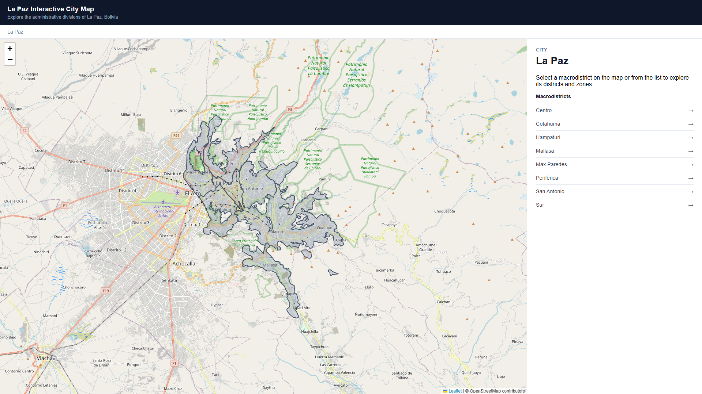
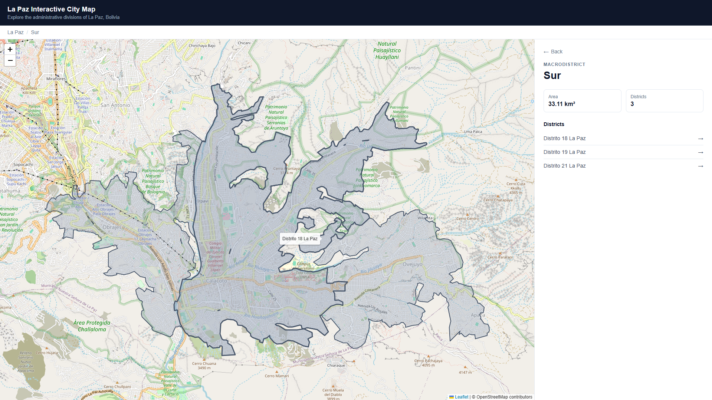
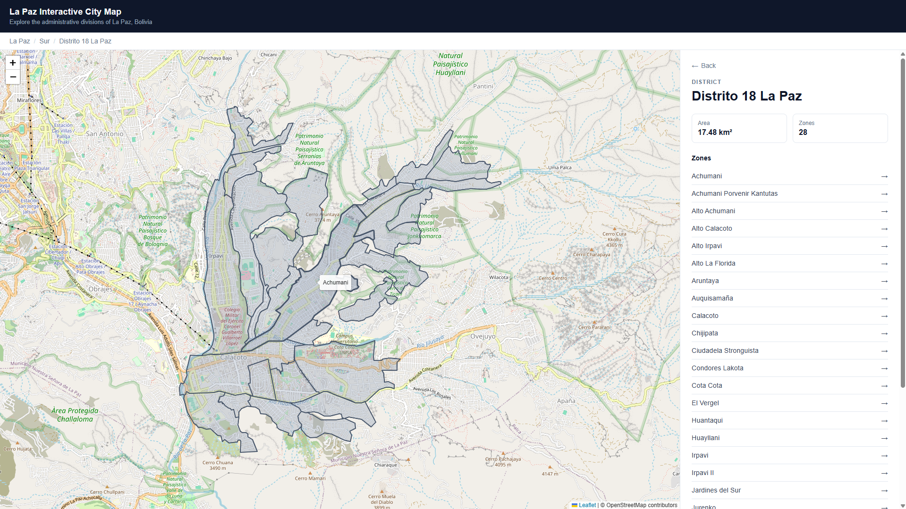
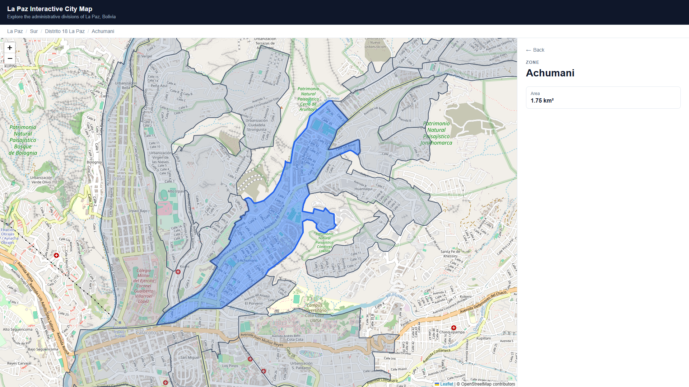

# La Paz Interactive City Map

Explore La Paz, Bolivia, through an interactive map of its macrodistricts, districts and zones. I built this portfolio project with **React, JavaScript and Leaflet** to develop my frontend skills and bring geographic data into an interactive application.

**8 macrodistricts · 22 districts · 188 zones** in the bundled dataset.

## Explore the map

1. Select a macrodistrict on the map or in the side panel.
2. Choose a district to see its zones.
3. Select a zone to highlight it, zoom to it and view its area.
4. Use **Back** or the breadcrumb to move up the hierarchy.

The panel provides button-based navigation through every level. Use Tab to move between controls and Enter or Space to activate buttons. After panel navigation, focus moves to the new heading.

On narrow screens, the map appears above the independently scrollable information panel. Short landscape screens use two columns.

## Features

- Three-level geographic exploration with tooltips and polygon highlighting.
- Area statistics and district/zone counts.
- Consistent navigation through map polygons, lists, Back and breadcrumbs.
- Automatic map framing, including a closer view of a selected zone.
- Responsive layout and visible keyboard focus for panel and breadcrumb controls.
- Static GeoJSON data: no application backend or database connection at runtime.

## Screenshots

### Macrodistricts



Overview of La Paz and its macrodistricts.

### Districts



Districts within the selected macrodistrict.

### Zones



Zones within the selected district.

### Selected Zone



Highlighted zone with its area and location in the hierarchy.

## Run locally

Install **Node.js 22.12 or newer** and npm. From the project directory:

```sh
npm ci
npm run dev
```

Open the local URL printed by Vite. An internet connection is required to load the OpenStreetMap background tiles; the administrative polygons are bundled with the app.

| Command | Purpose |
| --- | --- |
| `npm run dev` | Start the development server |
| `npm run lint` | Check JavaScript and JSX with ESLint |
| `npm run build` | Generate the production site in `dist/` |
| `npm run preview` | Preview a production build locally |

Run the build before previewing it. The generated `dist/` directory is excluded from Git and should not be edited manually.

## Technology and structure

The frontend uses React, plain JavaScript/JSX, Vite, Leaflet, React Leaflet and CSS.

```text
src/
  App.jsx                 Selection state and hierarchy navigation
  App.css                 Application and responsive styles
  index.css               Global styles
  components/
    Breadcrumb.jsx        Hierarchy navigation
    CityMap.jsx           Leaflet map and geographic layer
    FitBounds.jsx         Map framing and container resize handling
    InfoPanel.jsx         Statistics and list navigation
  data/
    macrodistricts.geo.json
    districts.geo.json
    zones.geo.json
```

Each GeoJSON feature contains its geometry and the properties `id`, `name`, `parentId` and `areaKm2`. Each feature has a numeric ID, and `parentId` connects the administrative levels. React filters these static collections as the user navigates.

I kept the architecture simple, with local React state and static GeoJSON files. My goal was to make the map easy to explore while keeping the code understandable as I developed the project incrementally.

## Geographic data and credits

Zone data comes from [Mapa de Zonas de la Ciudad de La Paz (2020), published through Ciudatos Lab](https://ciudatoslab.org/datos/mapa-zonas-la-paz-2020/). The accompanying metadata identifies the **Gobierno Autónomo Municipal de La Paz (GAMLP)** as the data owner and **GeoBolivia / Rolando Aguilar** as the metadata author.

I grouped and merged the source zones according to their data to create the district and macrodistrict geometries. These are layers I derived for this project, not separate official boundary datasets.

The source describes zone boundaries as **referential**. This portfolio visualization does not establish official boundaries or claim that the 2020 dataset reflects current administrative divisions.

The background map uses **© [OpenStreetMap contributors](https://www.openstreetmap.org/copyright)**, independently of the administrative polygons.

See [data provenance](docs/DATA_SOURCES.md) for source dates and details about the derived layers.
